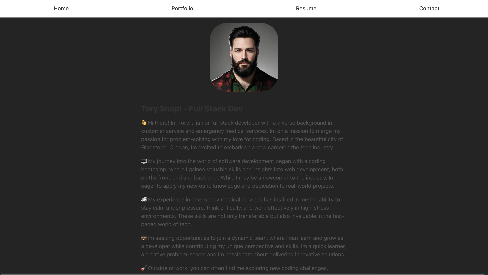

# react_portfolio

A professional looking portfolio built with React

## User Story

>AS AN employer looking for candidates with experience building single-page applications
>I WANT to view a potential employee's deployed React portfolio of work samples
>SO THAT I can assess whether they're a good candidate for an open position

## Acceptance Criteria

>GIVEN a single-page application portfolio for a web developer
>WHEN I load the portfolio
>THEN I am presented with a page containing a header, a section for content, and a footer

>WHEN I view the header
>THEN I am presented with the developer's name and navigation with titles corresponding to different sections of the portfolio

>WHEN I view the navigation titles
>THEN I am presented with the titles About Me, Portfolio, Contact, and Resume, and the title corresponding to the current section is highlighted

>WHEN I click on a navigation title
>THEN I am presented with the corresponding section below the navigation without the page reloading and that title is highlighted

>WHEN I load the portfolio the first time
>THEN the About Me title and section are selected by default

>WHEN I am presented with the About Me section
>THEN I see a recent photo or avatar of the developer and a short bio about them

>WHEN I am presented with the Portfolio section
>THEN I see titled images of six of the developer’s applications with links to both the deployed applications and the corresponding GitHub repository

>WHEN I am presented with the Contact section
>THEN I see a contact form with fields for a name, an email address, and a message

>WHEN I move my cursor out of one of the form fields without entering text
>THEN I receive a notification that this field is required

>WHEN I enter text into the email address field
>THEN I receive a notification if I have entered an invalid email address

>WHEN I am presented with the Resume section
>THEN I see a link to a downloadable resume and a list of the developer’s proficiencies

>WHEN I view the footer
>THEN I am presented with text or icon links to the developer’s GitHub and LinkedIn profiles, and their profile on a third platform (Stack Overflow, Twitter) 

## Installation

No installation is needed. Just go to the deployed app link below.

## Usage

This is a react based portfolio witha more professional and sterile feel than my Oregon Trail themed HTML based portfolio.

## Technologies Used

- React
- CSS
- VITE

## What I Learned

This is my first attempt at building a website using React. I must admit that it was a challenge to think of the various parts of the site as components of the end product rather than one whole piece. Once I was able to switch into that mindset, I could see the benefit of being able to reuse components without having to rewrite the code.

I am looking forward to learning more about react and in particular react native to build powerful and flexible apps.

## Screenshots

## Links

[Github Repo](https://github.com/TorySnopl/react_portfolio)

[Deployed App](https://torysnopl.github.io/react_portfolio/)

## Source Code

No source code was provided by U of O coding Bootcamp.

## Author

I am a University of Oregon full stack developer bootcamp student. I am looking to collaborate on any type of coding project to hone my skills and expand my knowledge base. Please check out my other projects on [github](https://github.com/TorySnopl). Lets connect via [LinkedIn](https://www.linkedin.com/in/tory-snopl-70b00a283/).

